# 目录
* [概述](#概述)
    * [算法效果](#算法效果)
    * [算法评价](#算法评价)
* [具体实现](#具体实现)
    * [问题观察](#问题观察)
    * [色彩过滤](#色彩过滤)
    * [角点检测](#角点检测)
    * [DBSCAN聚类](#DBSCAN聚类)
    * [线性检测(原创)](#线性检测(原创))
        * [问题描述](#问题描述)
        * [实现步骤](#实现步骤)
    * [源代码](#源代码)

# 概述
该算法用于识别图书馆内藏书书脊上的索书标签，在特定条件下可以有效快速的检测出索书标签，并有较强的鲁棒性，足以应对各种复杂的现实环境。

本算法使用python实现，使用了**OpenCV**的Harris角点检测算法以及**Scikit-learn**包中的DBSCAN聚类算法,并用纯python实现了直线匹配算法。整个算法在python这种运行效率较低的语言中能在4s内得到计算结果(主要计算瓶颈在纯python的直线匹配算法)，相信在C或JAVA等较为高效的语言中将会得到更好的表现，在之后的各个章节中将会具体描述各个算法是如何配合实现索书标签检测。


## 算法效果

以下是三个在实际环境中拍摄的三个素材

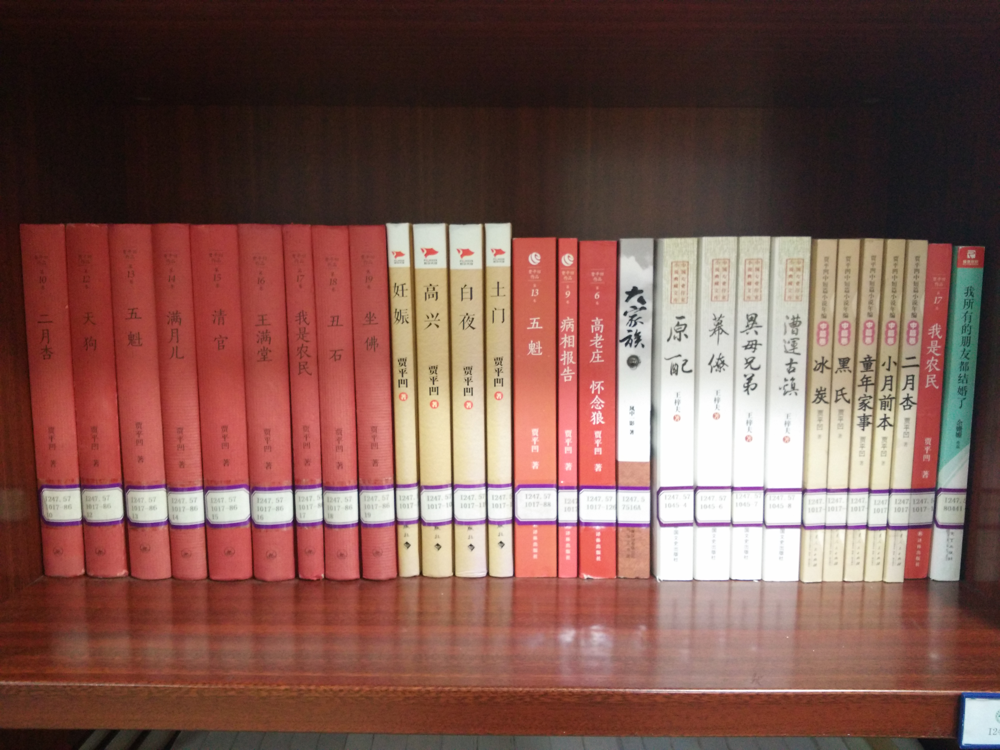
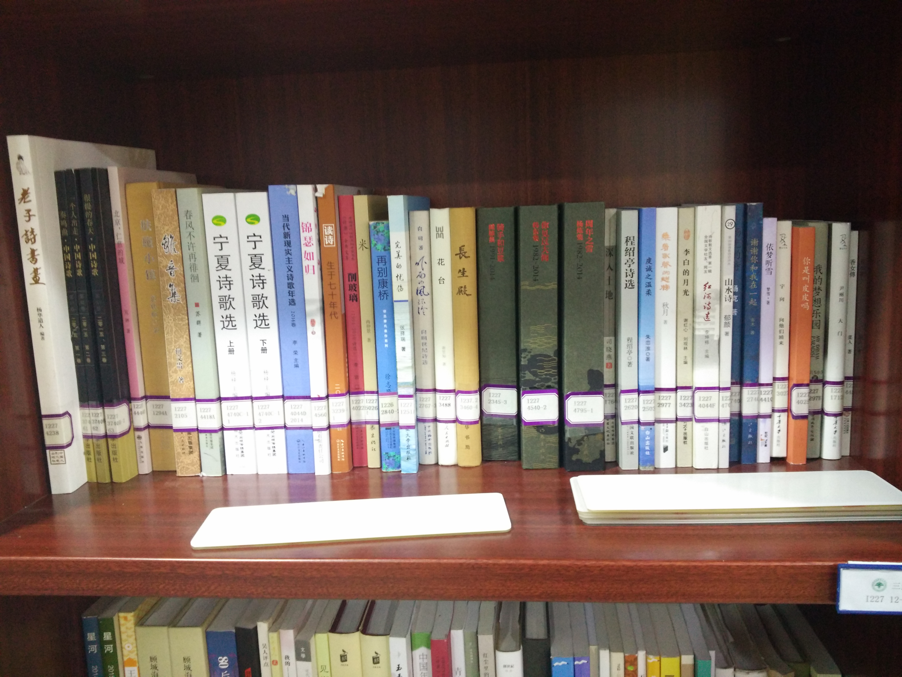
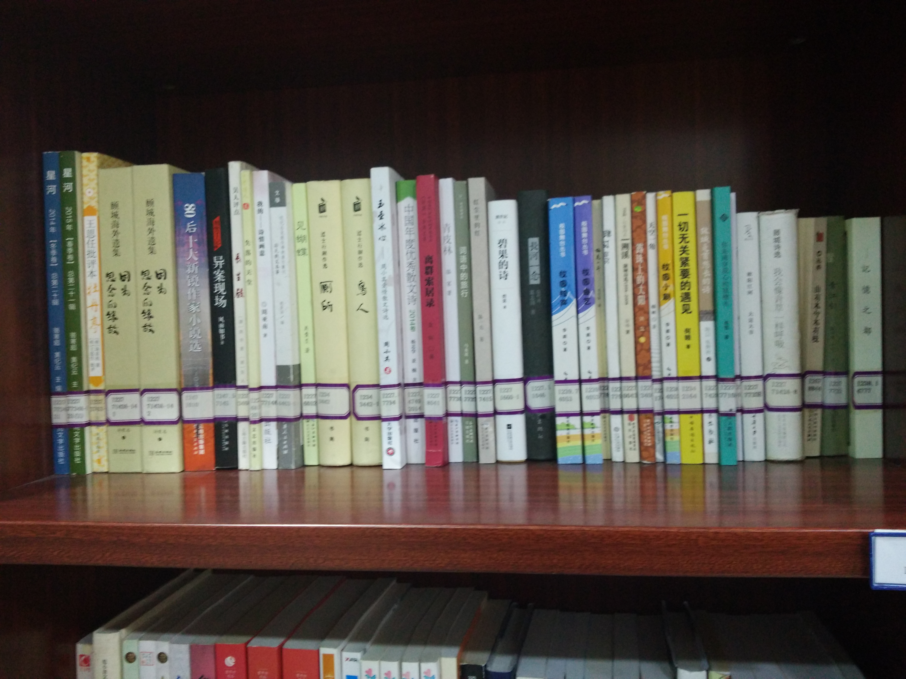


从上面的素材中可以看到，*素材2*的索书标签参差不齐，并且图书之间相互遮挡的现象存在，有些索书标签存在老化泛黄的现象，有些图书摆放不整齐等现象。下面是相对应的算法运行效果。

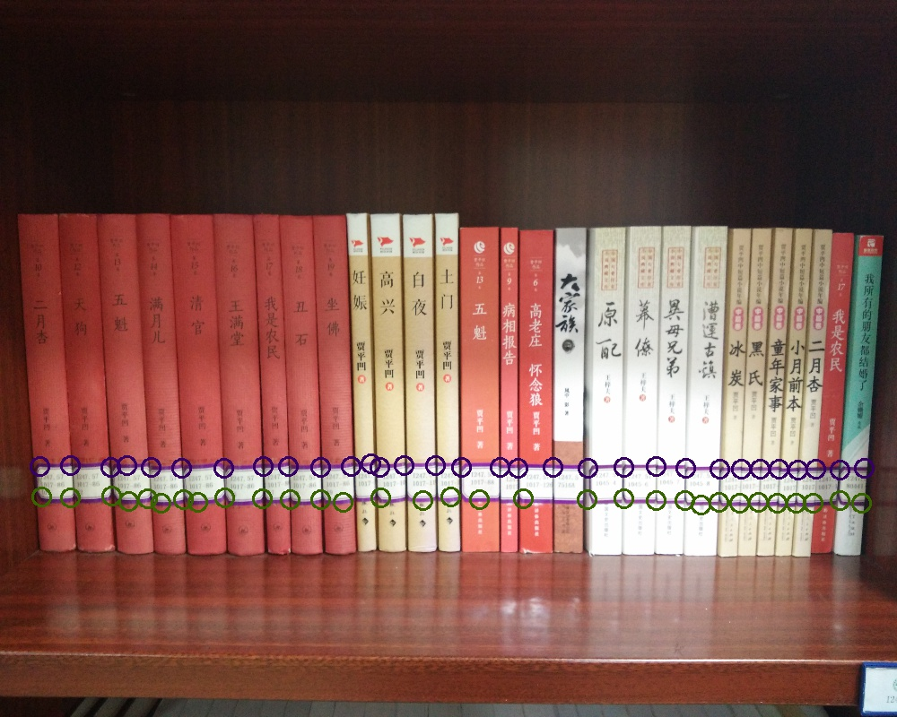
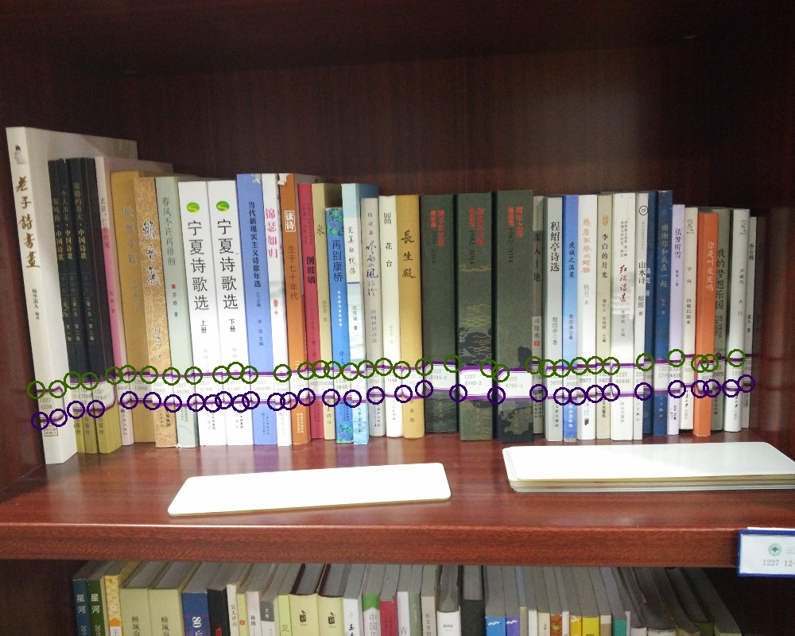
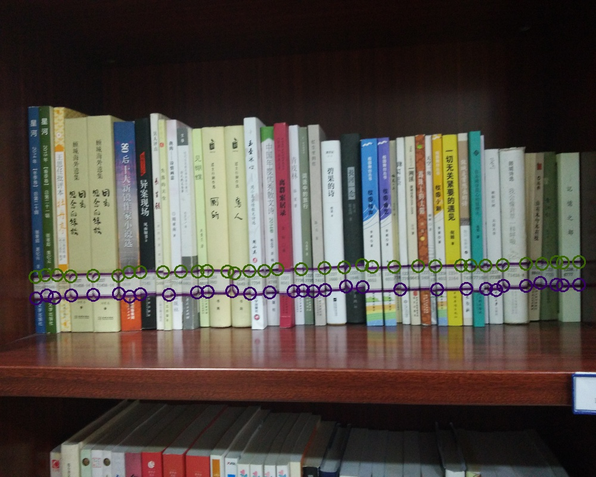

## 算法评价

从上面的运行效果可以看到，虽然没有完美的将每本书的每个索书标签的角点检测出来，但也没有混入任何噪声点。

虽然算法运行良好，但也要先说明算法运行所依赖的假设：
1. 索书标签的边框的颜色都是一样的（仅要求现实中颜色相近即可，不要出现红绿混合这样）
2. 索书标签在书脊上贴的高度一致，最起码在拍摄中不要偏差太远
3. 图书的数目不能太少，图书摆放相对整齐
4. 拍摄现场的光源不要太极端(非单色光源，比如KTV的彩灯)

算法的几个鲁棒性：
1. 对噪声不敏感
2. 对于图书的花纹不敏感
3. 拍摄角度无要求

# 具体实现

## 问题观察


从上面拍摄的照片中可以看到，图书的索书标签高度相对一致，边框色彩也一致，同时图书的花纹相当丰富和复杂。

观察索书标签可以发现，索书标签的形状为四边形，即使在被遮掩的情况下仍然能观察到两条平行直线，同时颜色相对较暗，不易受到外界光源的影响(额，有色彩鲜艳的边框，反正在我需要解决问题的环境中索书标签边框的颜色都是这种紫红色)

索书标签内部为白底灰字，首先白底容易受外界光源的影响，并且在图书老化的过程中相对边框更加容易变色。所以整个算法将会围绕边框检测进行

## 色彩过滤
色彩过滤的规则：
**红色大于绿色，蓝色大于绿色，红-蓝 <15 **

上面的规则是采样了各个边框的色彩总结的到的规则，当需要应用到不同色彩的边框时需要重新总结

下面是色彩过滤的效果

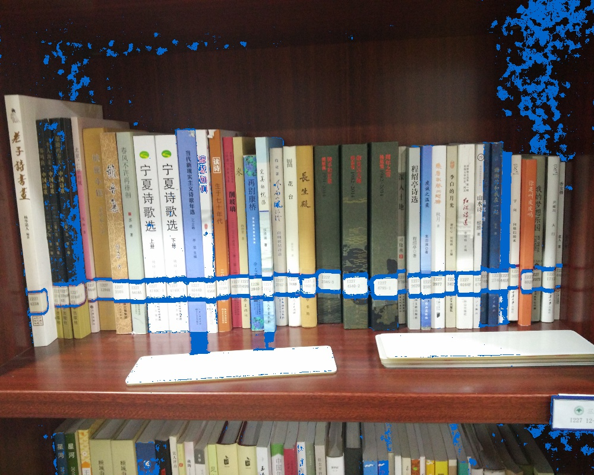

成功被选择的像素点被标为蓝色，从图中可以看到有相当多的噪声，但不用担心，在下一个处理阶段将排除大量的噪声点。

## 角点检测
角点检测的理论可以参考[Harris角点检测原理分析](http://blog.csdn.net/newthinker_wei/article/details/45603583)

在这里就直接用OpenCV里的角点检测算法，以下是的角点检测结果是蓝绿红三个通道角点检测后合成的结果
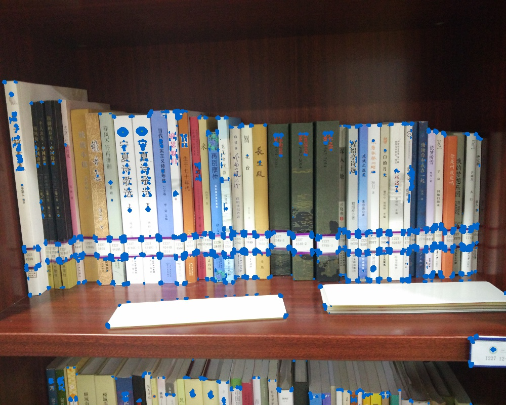

将角点检测得到的像素点和色彩过滤后的像素点做并运算，得到以下效果

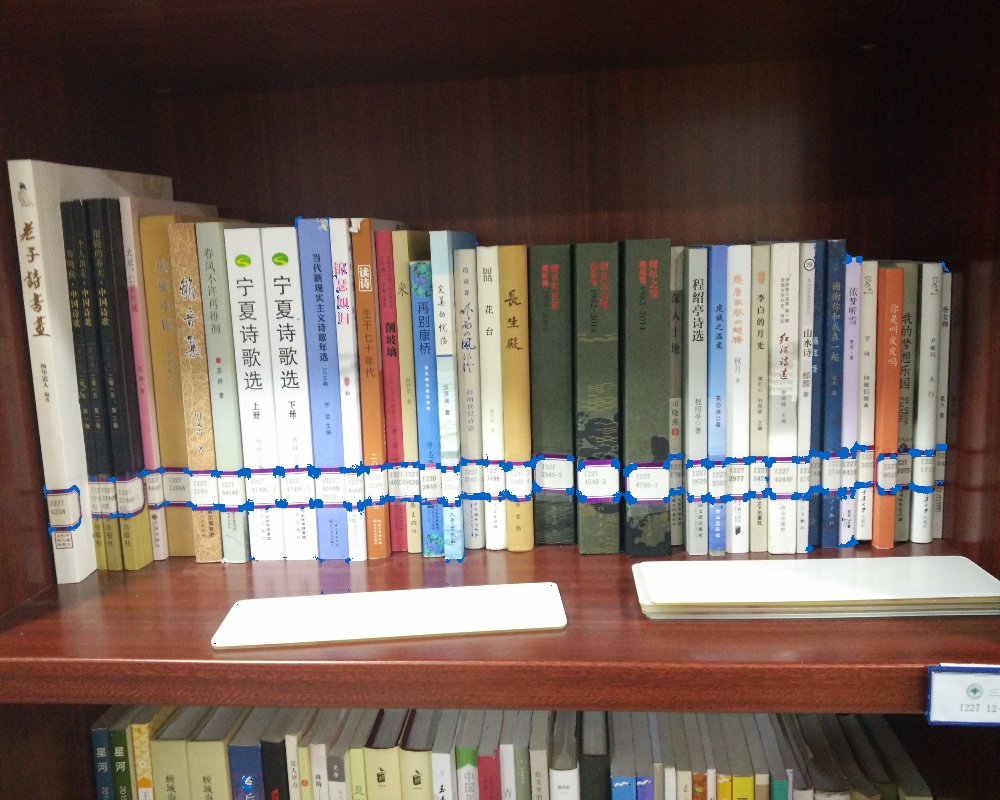

从图中可以看到，相当多的噪声点已经被去除，并且索书标签的信息也没有丢失，在下一个DBSCAN聚类处理过程当中将会进一步将噪声点去除。因为噪声点已经比较少了，为了更直观的观察噪声点的数目，下面这张图可以更加直观的看到相关的信息以及噪声情况


从上面的图中可以看到噪声点的数目还是相当多的

## DBSCAN聚类

从上一张图中可以发现，我们需要的像素点都比较聚集，通过参考各种聚类算法，可以发现DBSCAN聚类非常适合用于筛选目标点

关于各种无监督的聚类算法可以参考[Clustering](http://scikit-learn.org/stable/modules/clustering.html#clustering)
### 第一阶段聚类
应用DBSCAN聚类之后，删除离群点得到以下结果：
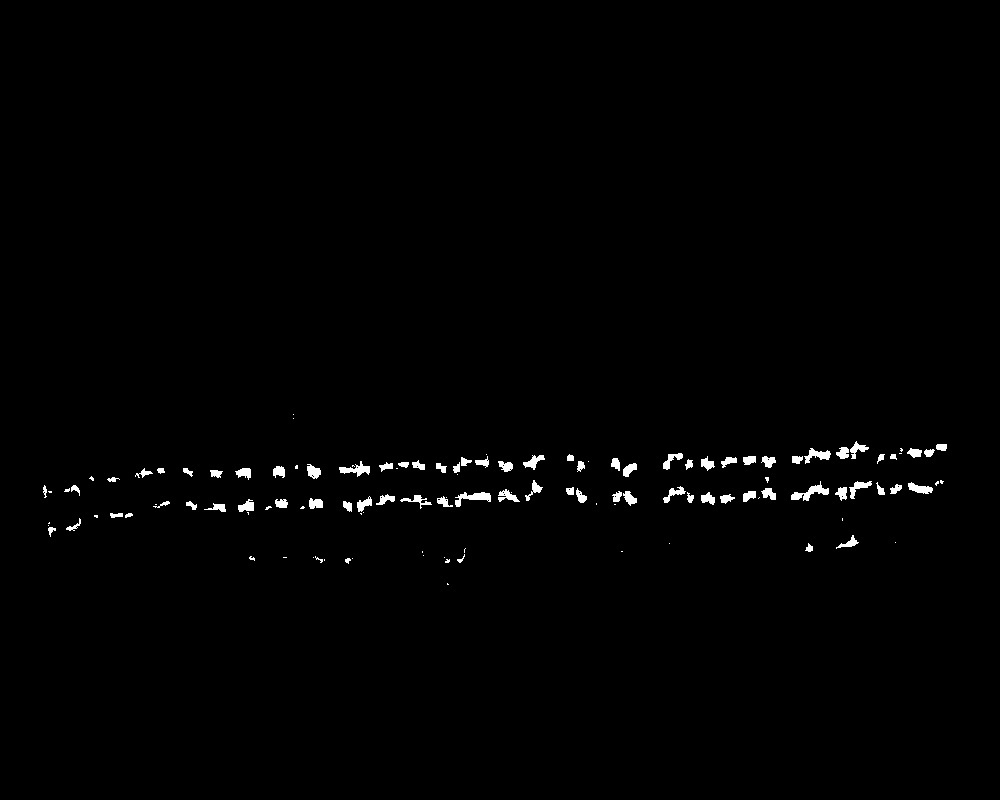

从图中可以看到，除了靠近识别目标的噪音，其他噪音都已经被删除。同时可以发现，识别目标像素接近一条直线（既算法要求的一个假设，各个索引标签所在的高度要接近一致）

匹配这条直线我自己设计了一个算法，为了简化计算，将连续的像素块合并为一个点。
### 第二阶段聚类
调整DBSCAN的eps参数，得到数个聚类好的分类，通过该类中所有点的**坐标求平均值**得到该类点集的代表点。这些代表点在图像上显示为
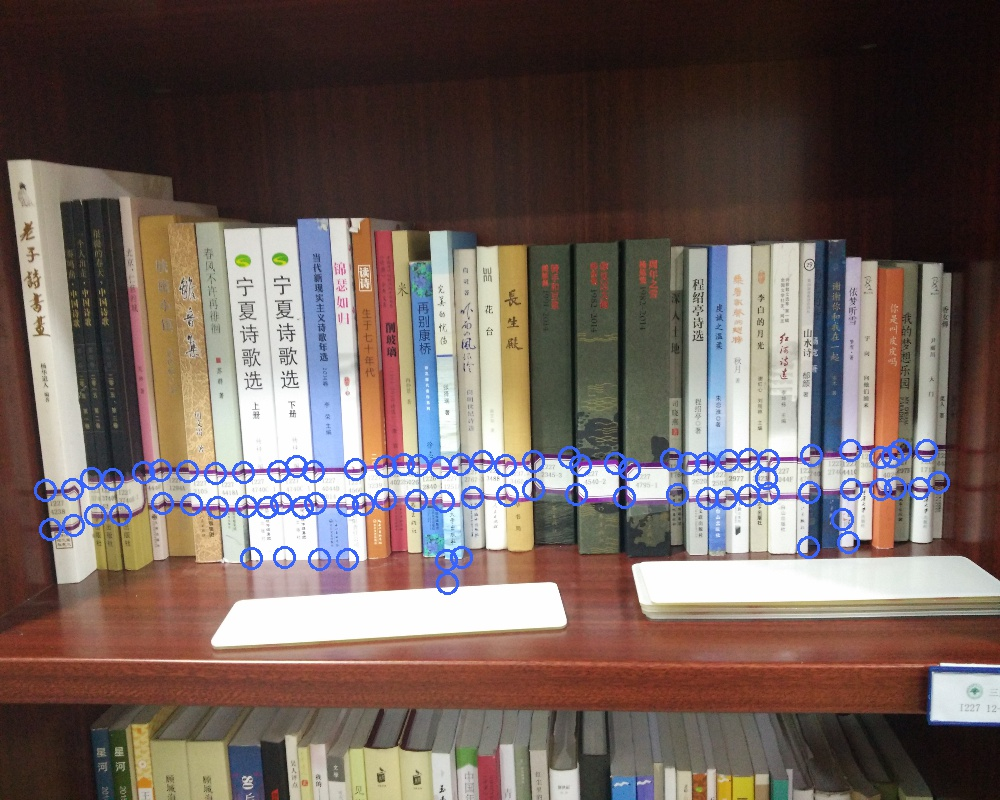

在当前的例子中，总共有81个点。通过下面的线性检测，将非'直线'上点排除掉后，得到整个算法的运行结果

## 线性检测(原创)

## 问题描述
从上面的小结中，可以看到，算法需要的点几乎在一条直线上。

为了得到这些点，我总结出以下特征：
 1. 目标点之间的距离较近
 2. 目标直线上的点数目最多

下面两个是直线的关键性约束：
* 直线中的任意点与其他任意点所产生的倾角，与直线的倾角差距不大
* 直线中有存在两个相邻点的倾角可以代表整个直线的倾角


## 实现步骤

简单的说就是：
1. 找到两个相邻点，并计算其所代表直线的角度
2. 从这两个相邻点的临近点中找到可以加入这条直线的点，并在加入后满足上面的关键性约束

通过计算之后，寻找两条不相交的点数最多的直线（为什么是两条，从上面的图中可以看到），将这两个直线的点集用不同颜色画到原始图像上得到，还有那些被排除的点同时绘制在一个图像上，可以看到


不加上被排除的点，得到结果：


```python

```
